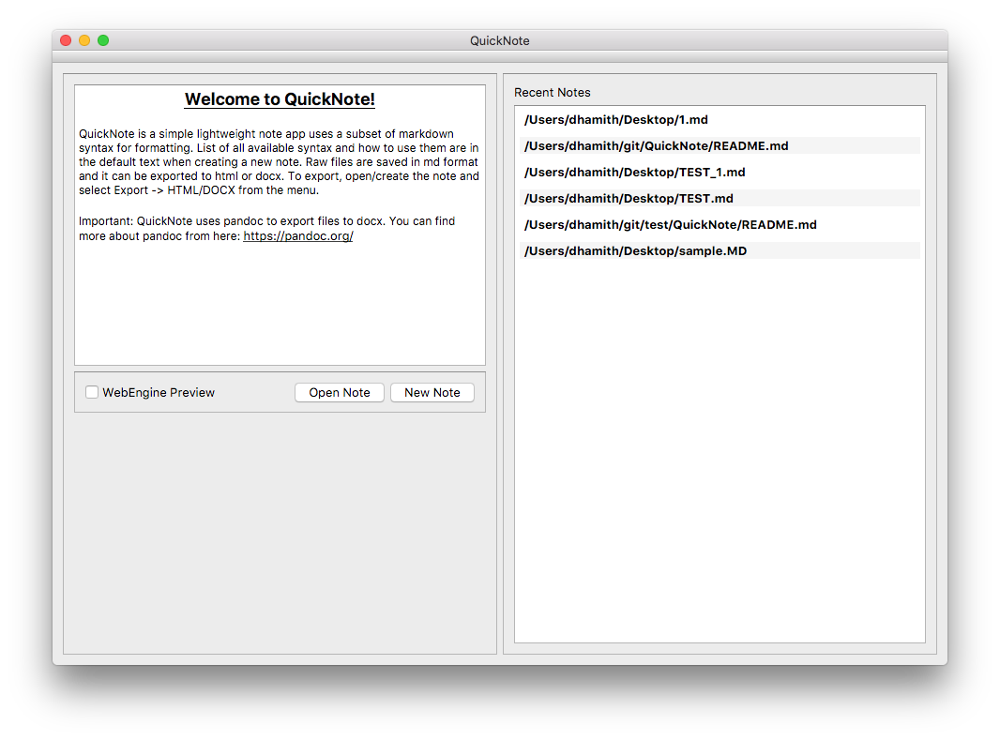
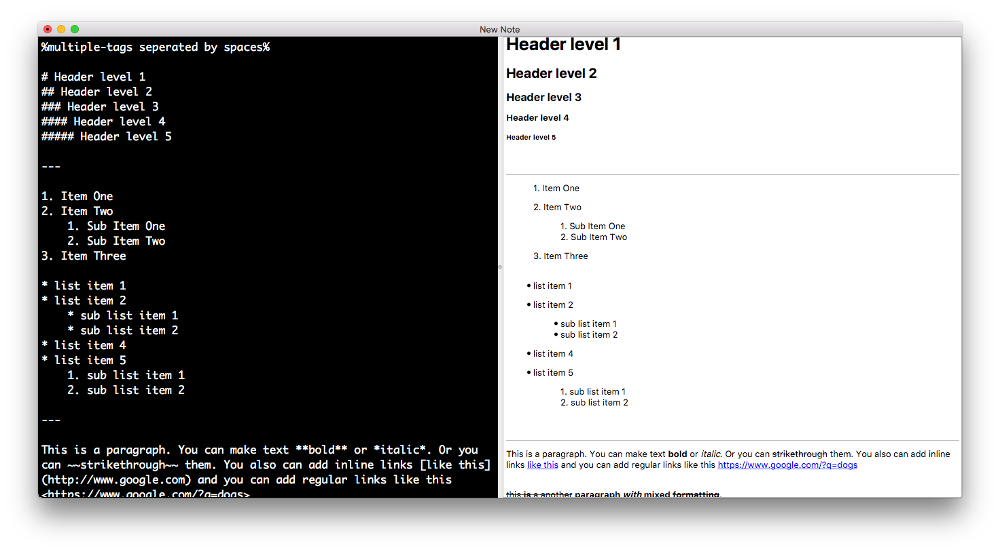
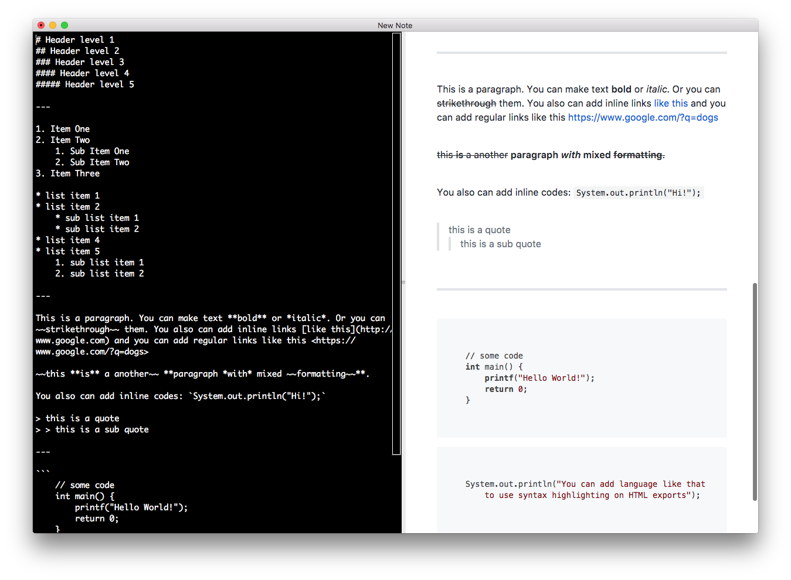

## QuickNote

QuickNote is a simple note app that uses subset of markdown syntax for formatting. It can save your notes in markdown format and export them to html, pdf or docx format. QuickNote uses pandoc for docx exports. There is syntax highlighting in exported html and WebEngine preview thanks to [highlight.js](https://highlightjs.org). Internet connection required to syntax highlighting to be activated on exported html file or WebEngine preview.

### Features
- Markdown Formatting
- Live Preview
- Export to HTML, PDF and docx
- Save as .md
- Recent note list

### TODO

- [x] Syntax support
  - [x] Headers
  - [x] Ordered/Unordered Lists
  - [x] Bold, Italic, Strikethrough, Inline codes
  - [x] Blockquotes
  - [x] Images
  - [x] Links
  - [x] Code Blocks
  - [ ] Tables 
- [x] Recent documents view
- [x] Export
  - [x] HTML
  - [x] DOCX
  - [x] PDF (On webEnginePreview)
- [x] Syntax highlighting in exported HTML
- [x] WebEngine Preview with full HTML+CSS support
- [ ] Categories/Tags ? 

### Screenshots

