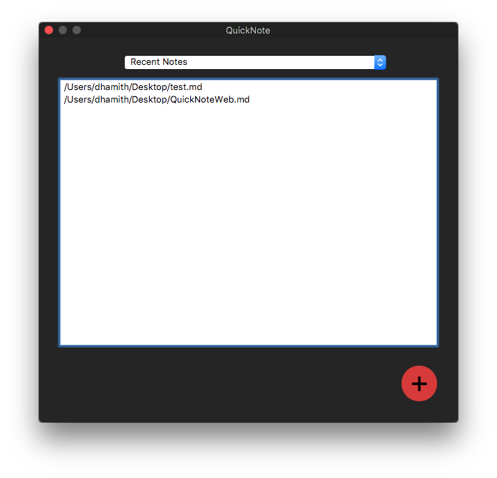
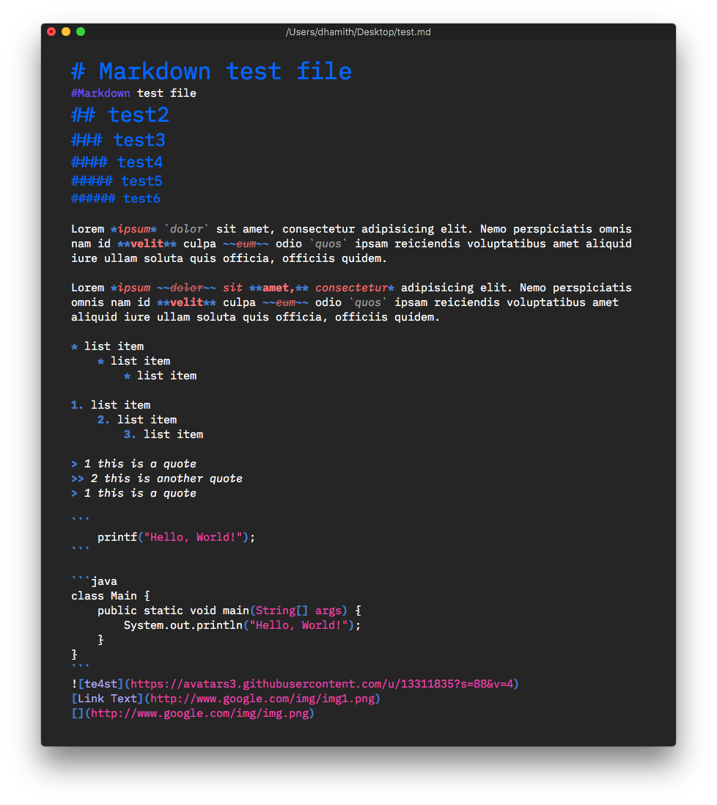

## QuickNote

QuickNote is a simple note app that uses subset of markdown syntax for
formatting. QuickNote also lets you export the note to HTML or copy selected
formatted text as HTML. 

### Features
- Markdown Formatting
- Markdown syntax highlighting
- Export to HTML
- Copy selection as HTML
- Save as .md
- Recent note list
- Organize notes with tags

### Screenshots

