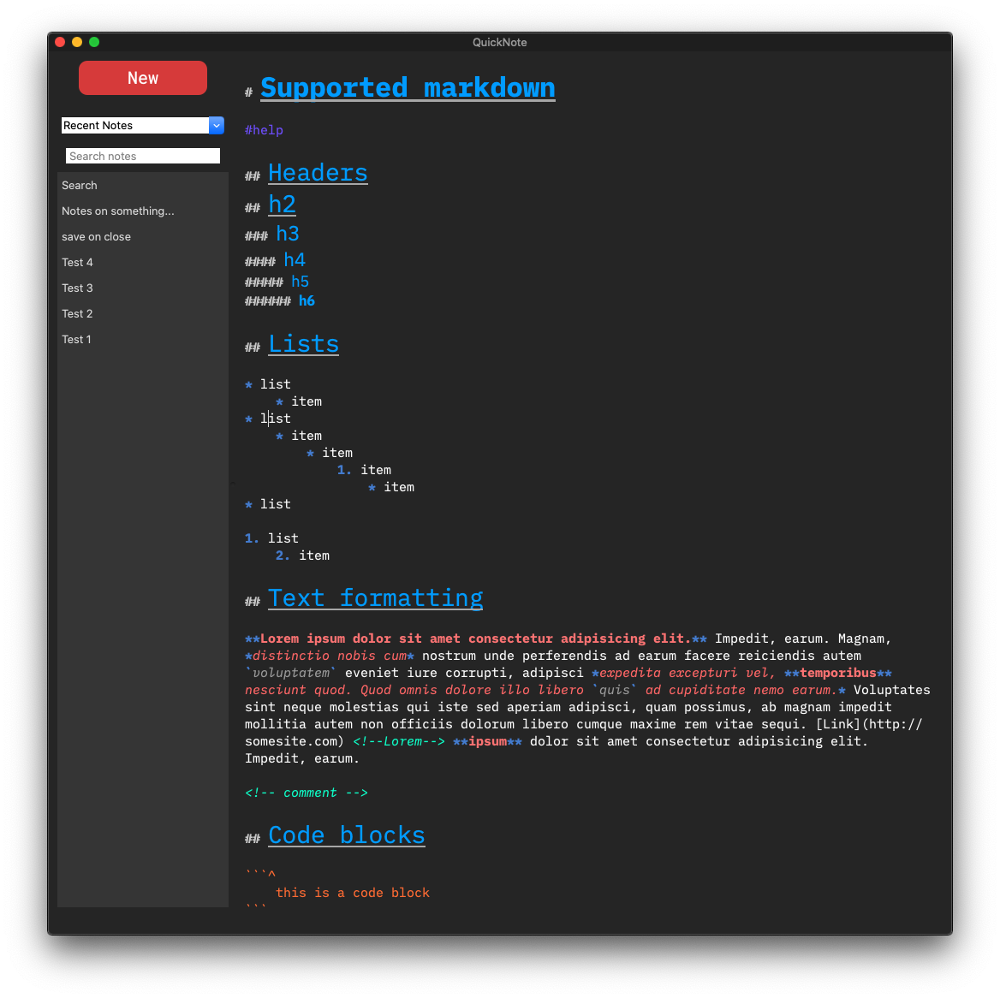
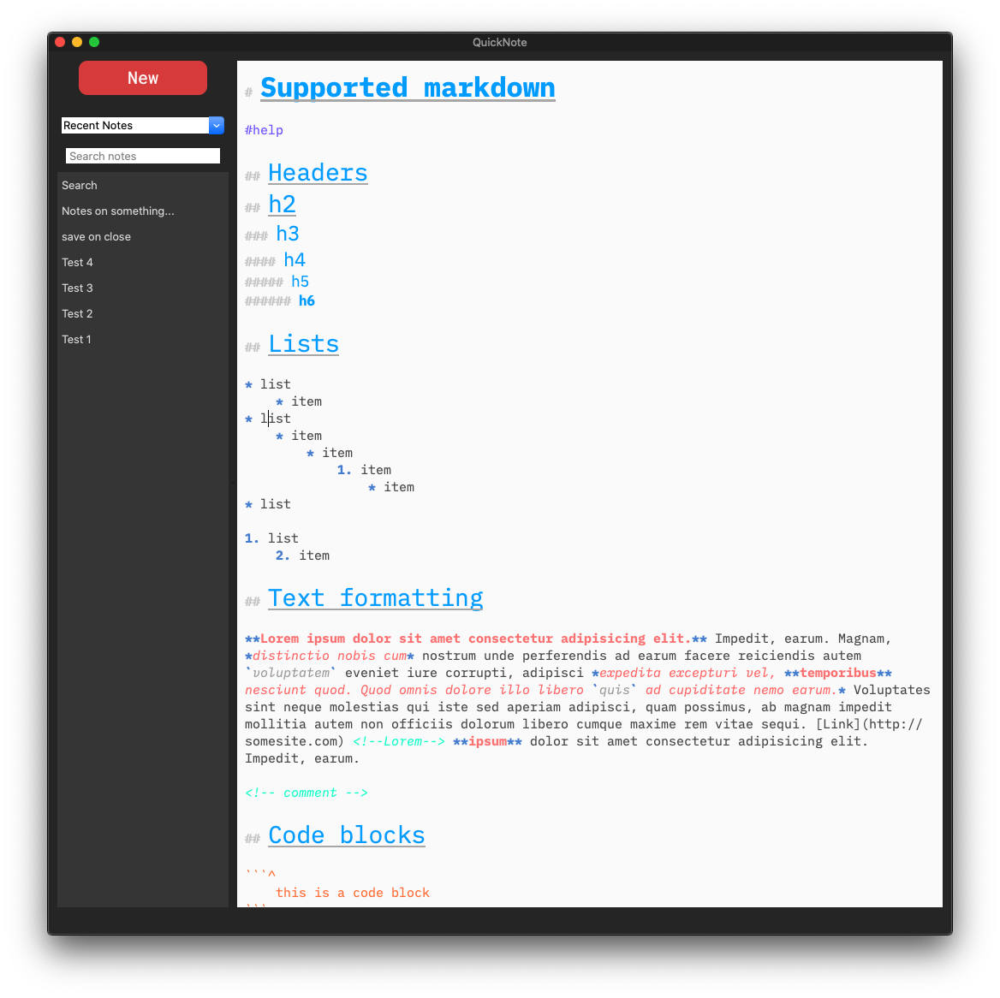

## QuickNote


QuickNote is a simple note app that uses subset of markdown syntax for formatting. QuickNote also lets you export the note to HTML or copy selected formatted text as HTML. 

### Features
* Markdown Formatting
* Markdown syntax highlighting
* List indentation and auto numbering
* Note encryption/decryption
* Export to HTML
* Copy selection as HTML
* Save as .md
* Recent note list
* Organize notes with tags
* Change editor font
* Dark/Light modes
* Word counter

### Using lists
Unordered or ordered list can be created using `* test` or numbering items like `10. test`. Sublists can be created with indentation (4 spaces OR 1 tab).
Once the list is started, next items will get auto indented (and auto numbered if list is a ordered one) to the previous item's level and by pressing `SHIFT + TAB` the indentation can be reduced by one level. Pressing `ENTER` on a empty list item ends the list.
#### Example 
```text
* test
    * test
        * test
            1. test
            2. test
    * test
* test

1. test
2. test
    * test
        * test
3. test
```


### Screenshots




